------------------------------------------------------------------------

# Dataset Description

The primary dataset for this project is **Advance Retail Sales: Retail
Trade** (Code: **RSXFSN**), obtained from the Federal Reserve Economic
Data (FRED). The data records monthly retail trade sales figures in the
United States and is not seasonally adjusted.

------------------------------------------------------------------------

# 1. What Other Factors Might Influence the Time Series?

The primary dataset, **Advance Retail Sales: Retail Trade (RSXFSN)**, is
influenced by various economic and demographic factors. The following
covariates have been identified as potentially impactful:

- **Revolving Consumer Credit Owned and Securitized (REVOLNS)**: This
  measures consumer borrowing behavior, which could directly affect
  retail sales. An increase in credit availability might lead to higher
  retail spending.
- **Unemployment Rate (UNRATENSA)**: A higher unemployment rate
  typically reduces consumer spending power, leading to lower retail
  sales.
- **Population (POPTHM)**: Population growth provides a scaling context
  for retail sales. An increasing population might align with higher
  retail demand.

### How These Factors Will Be Incorporated

Using the `fpp3` package, the following approaches will be employed to
incorporate these covariates into the analysis:

- **ARIMAX Model**: A dynamic regression model will be fitted using
  ARIMA, where the covariates will be included as external regressors to
  account for their impact on retail sales.
- **TSLM (Time Series Linear Model)**: Covariates will be used as
  predictors in a regression framework to explain variations in retail
  sales over time.

The analysis will also involve: - **Model Diagnostics and Comparison**:
Metrics such as **AIC**, **BIC**, and **RMSE** will be used to evaluate
the performance of the models, with and without the inclusion of
covariates.

By incorporating these covariates, the analysis aims to improve forecast
accuracy and provide a better understanding of the drivers of retail
sales.

The covariates were recorded monthly and they are not seasonally
adjusted.

Units:

- **Advance Retail Sales: Retail Trade (RSXFSN)** - Millions of Dollars
- **Population (POPTHM)** - Thousands
- **Unemployment Rate (UNRATENSA)** - Percent
- **Revolving Consumer Credit Owned and Securitized (REVOLNS)** -
  Billions of Dollars

------------------------------------------------------------------------

# 2. How Does the Time Series Look?

I will create line plots for visualization, and perform STL
decomposition.

``` r
# Load datasets and convert to tsibble format
population <- read.csv("POPTHM.csv") %>%
  mutate(Date = as.Date(DATE, format = "%Y-%m-%d")) %>%  mutate(Date = yearmonth(Date)) %>% 
  as_tsibble(index = Date) %>% select(-DATE)

consumer_credit <- read.csv("REVOLNS.csv") %>%
  mutate(Date = as.Date(DATE, format = "%Y-%m-%d")) %>%  mutate(Date = yearmonth(Date)) %>% 
  as_tsibble(index = Date) %>% select(-DATE)

retail_sales <- read.csv("RSXFSN.csv") %>%
  mutate(Date = as.Date(DATE, format = "%Y-%m-%d")) %>%  mutate(Date = yearmonth(Date)) %>% 
  as_tsibble(index = Date) %>% select(-DATE)

unemployment <- read.csv("UNRATENSA.csv") %>%
  mutate(Date = as.Date(DATE, format = "%Y-%m-%d")) %>%  mutate(Date = yearmonth(Date)) %>% 
  as_tsibble(index = Date) %>% select(-DATE)


# Plotting each series
retail_sales %>% autoplot(RSXFSN) +
  labs(
    title = "Retail Sales Over Time (RSXFSN)",
    x = "Date",
    y = "Retail Sales"
  )
```

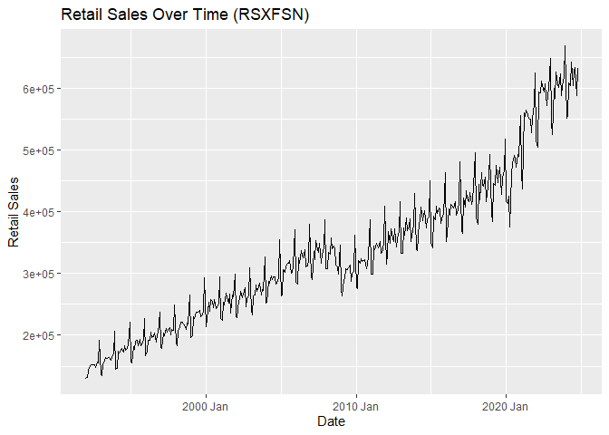<!-- -->

``` r
population %>% autoplot(POPTHM) +
  labs(
    title = "Population Over Time (POPTHM)",
    x = "Date",
    y = "Population"
  )
```

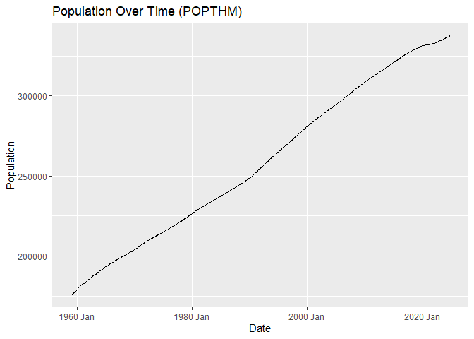<!-- -->

``` r
consumer_credit %>% autoplot(REVOLNS) +
  labs(
    title = "Consumer Credit Over Time (REVOLNS)",
    x = "Date",
    y = "Consumer Credit"
  )
```

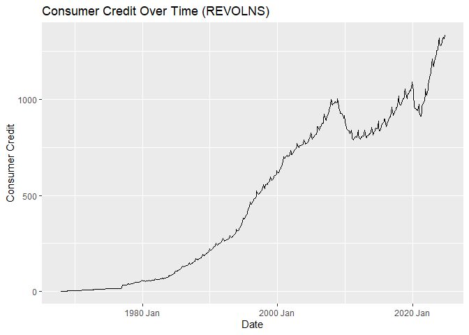<!-- -->

``` r
unemployment %>% autoplot(UNRATENSA) +
  labs(
    title = "Unemployment Rate Over Time (UNRATENSA)",
    x = "Date",
    y = "Unemployment Rate"
  )
```

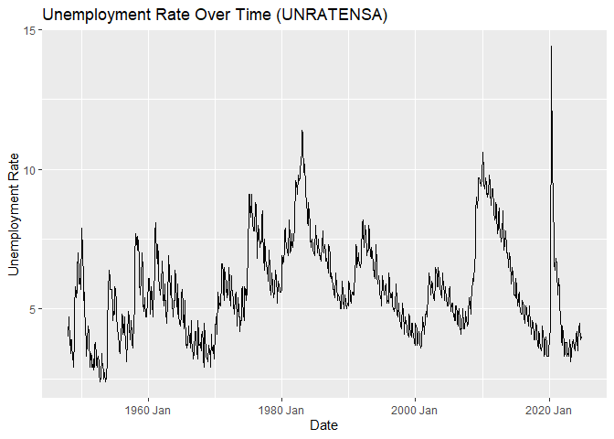<!-- -->

``` r
# Perform STL decomposition for each series

# Retail Sales (RSXFSN)
retail_sales %>%
  model(stl = STL(RSXFSN)) %>%
  components() %>%
  autoplot() +
  labs(title = "STL Decomposition: Retail Sales (RSXFSN)",
       y = "Retail Sales")
```

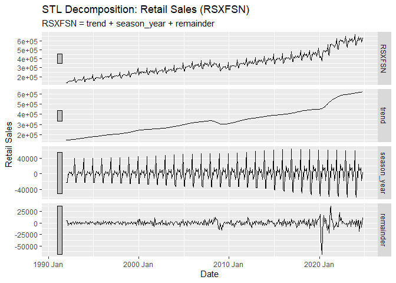<!-- -->

``` r
# Population (POPTHM)
population %>%
  model(stl = STL(POPTHM)) %>% # STL decomposition
  components() %>% # Extract components
  autoplot() + # Plot components
  labs(title = "STL Decomposition: Population (POPTHM)",
       y = "Population")
```

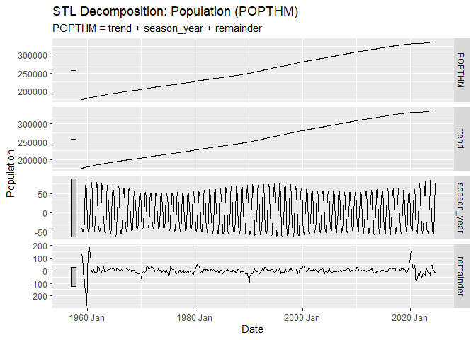<!-- -->

``` r
# Consumer Credit (REVOLNS)
consumer_credit %>%
  model(stl = STL(REVOLNS)) %>%
  components() %>%
  autoplot() +
  labs(title = "STL Decomposition: Consumer Credit (REVOLNS)",
       y = "Consumer Credit")
```

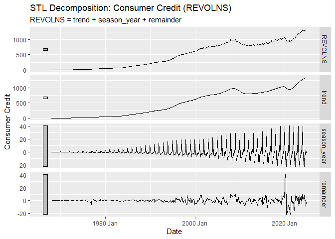<!-- -->

``` r
# Unemployment Rate (UNRATENSA)
unemployment %>%
  model(stl = STL(UNRATENSA)) %>%
  components() %>%
  autoplot() +
  labs(title = "STL Decomposition: Unemployment Rate (UNRATENSA)",
       y = "Unemployment Rate")
```

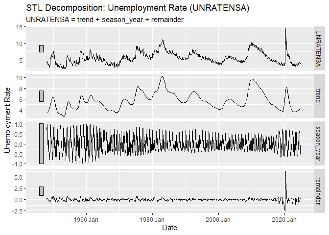<!-- -->

### Retail Sales

- **Trend**: Clear upward trajectory over time.
- **Seasonality**: Regular yearly fluctuations are visible, with
  pronounced peaks and troughs, probably corresponding to holiday dates.
- **Noise**: Small short-term variations are visible.

### Population

- **Trend**: Steady linear growth over the decades.
- **Seasonality**: Minimal evidence of seasonality, as population
  changes gradually.
- **Noise**: Little to no noise present.

### Consumer Credit

- **Trend**: Increasing trend, particularly accelerating from 2000
  onward.
- **Seasonality**: Noticeable cyclical fluctuations.
- **Noise**: Spikes in the remainder component (e.g., near 2020) suggest
  external factors like financial crises, e.g. COVID.

### Unemployment Rate

- **Trend**: General cyclical pattern with peaks during recessions
  (e.g., 2008 and 2020).
- **Seasonality**: Mild annual variation.
- **Noise**: Sharp increases during economic downturns (e.g., COVID-19
  in 2020).

------------------------------------------------------------------------

### Comparing the Time Series

### Relationships

#### Retail Sales and Consumer Credit

- Both series exhibit upward trends, suggesting an increase in economic
  activity over time.
- Peaks in Retail Sales might correlate with increased credit usage,
  especially during holiday seasons.

#### Retail Sales and Population

- Retail Sales likely scale with population growth, as larger
  populations generate higher consumption levels.

#### Retail Sales and Unemployment Rate

- An inverse relationship might exist: higher unemployment often
  coincides with reduced Retail Sales.

------------------------------------------------------------------------

# 3. How Good Is the Model?

``` r
# Combine datasets based on Date and filter rows with missing Retail Sales
combined_data <- retail_sales %>%
  full_join(population, by = "Date") %>%
  full_join(consumer_credit, by = "Date") %>%
  full_join(unemployment, by = "Date") %>%
  filter(!is.na(RSXFSN))


# Fit model with `lm`
fit <- lm(
  RSXFSN ~ POPTHM + REVOLNS + UNRATENSA,
  data = combined_data
  )


# Check for multicolinearity using `VIF`
# VIF
regclass::VIF(fit)
```

       POPTHM   REVOLNS UNRATENSA 
     7.523555  7.824283  1.140837 

## Since all predictors have less than 10 VIF, I will keep all of them.

``` r
# Fit TSLM with ARIMA errors
fit_tslm_arima <- combined_data %>%
  model(
    tslm = ARIMA(RSXFSN ~ POPTHM + REVOLNS + UNRATENSA)
  )

# Report fit
print("=========TSLM with ARIMA ERRORS=========")
```

    [1] "=========TSLM with ARIMA ERRORS========="

``` r
report(fit_tslm_arima)
```

    Series: RSXFSN 
    Model: LM w/ ARIMA(1,1,2)(0,1,2)[12] errors 

    Coefficients:
              ar1     ma1      ma2     sma1     sma2    POPTHM   REVOLNS
          -0.6457  0.1183  -0.6325  -0.6039  -0.0865  -26.1675  -61.9663
    s.e.   0.1019  0.0888   0.0554   0.0557   0.0502    4.9024   33.2561
           UNRATENSA
          -5931.1113
    s.e.    654.4573

    sigma^2 estimated as 77774545:  log likelihood=-3997.87
    AIC=8013.74   AICc=8014.22   BIC=8049.22

``` r
# Fit a simple ARIMA model without covariates
fit_simple_arima <- combined_data %>%
  model(simple_arima = ARIMA(RSXFSN))

# Report fit
print("=========Simple ARIMA Report=========")
```

    [1] "=========Simple ARIMA Report========="

``` r
report(fit_simple_arima)
```

    Series: RSXFSN 
    Model: ARIMA(1,1,2)(0,1,1)[12] 

    Coefficients:
              ar1     ma1      ma2     sma1
          -0.5342  0.2239  -0.4367  -0.7295
    s.e.   0.0993  0.0920   0.0455   0.0328

    sigma^2 estimated as 94963916:  log likelihood=-4042.68
    AIC=8095.36   AICc=8095.52   BIC=8115.08

``` r
# Plot residuals for both models
fit_tslm_arima %>% gg_tsresiduals() +
  labs(title = "Residuals for ARIMA with Covariates")
```

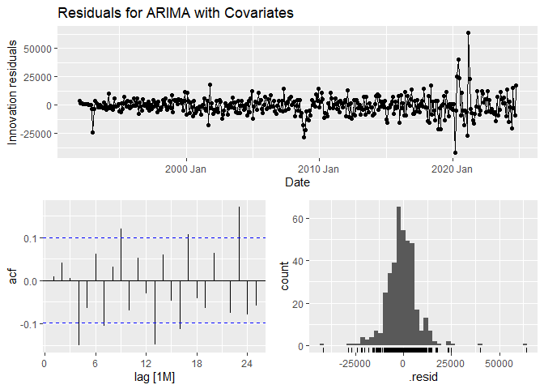<!-- -->

``` r
fit_simple_arima %>% gg_tsresiduals() +
  labs(title = "Residuals for Simple ARIMA (No Covariates)")
```

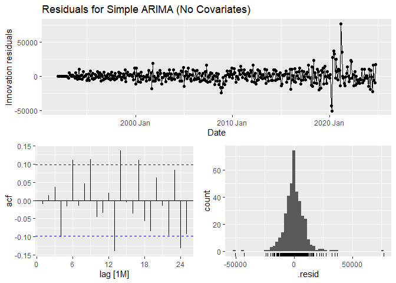<!-- -->

``` r
# Perform Ljung-Box test for both models
residual_diagnostics <- bind_rows(
  fit_tslm_arima %>%
    augment() %>%
    features(.innov, ljung_box, lag = 12, dof = 8) %>%
    mutate(Model = "ARIMA with Covariates"),
  
  fit_simple_arima %>%
    augment() %>%
    features(.innov, ljung_box, lag = 12, dof = 4) %>%
    mutate(Model = "Simple ARIMA (No Covariates)")
)

print(residual_diagnostics)
```

    # A tibble: 2 x 4
      .model       lb_stat lb_pvalue Model                       
      <chr>          <dbl>     <dbl> <chr>                       
    1 tslm            27.4 0.0000168 ARIMA with Covariates       
    2 simple_arima    17.5 0.0252    Simple ARIMA (No Covariates)

## How do we know if the model is good?

To evaluate a model’s quality, I will examine the residuals for patterns
that indicate poor fit. Residuals should exhibit no significant
autocorrelation, be normally distributed, and resemble white noise. Any
deviations, such as significant spikes in the ACF plot or patterns in
residuals, suggest that the model may need adjustments.

------------------------------------------------------------------------

## Residual Analysis and Diagnostic Tools

### **Simple ARIMA Model**

- **Residual Patterns**:  
  The residuals from the simple ARIMA model exhibit significant
  autocorrelation, as indicated by the Ljung-Box test p-value being less
  than 0.05. This suggests that the residuals do not perfectly resemble
  white noise, and the model does not fully capture the dynamics of the
  data.

- **Model Fit (AIC and BIC)**:  
  The AIC (**8095.36**) and BIC (**8115.08**) values are higher compared
  to the model with covariates, suggesting a worse fit overall.

------------------------------------------------------------------------

### **TSLM with ARIMA Errors**

- **Residual Patterns**:  
  Residuals from the TSLM model with covariates also exhibit significant
  autocorrelation, as indicated by the Ljung-Box test p-value being less
  than 0.05 (**p = 0.00002**). This suggests that while covariates
  improve fit metrics, the residuals still show autocorrelation and are
  not well-behaved.

- **Ljung-Box Test Results**:  
  The p-value from the Ljung-Box test is **significant (p \< 0.05)**,
  indicating that the residuals are autocorrelated and do not resemble
  white noise.

- **Model Fit (AIC and BIC)**:  
  The AIC (**8013.74**) and BIC (**8049.22**) values are lower than the
  simple ARIMA model, indicating a better fit when covariates are
  included.

------------------------------------------------------------------------

## Does including covariates improve the model?

Including covariates (`POPTHM`, `REVOLNS`, and `UNRATENSA`) in the TSLM
model:

- **Reduces AIC and BIC values** compared to the simple ARIMA model,
  suggesting improved model fit in terms of these metrics.
- However, the **Ljung-Box test results indicate significant
  autocorrelation in residuals (p \< 0.05)**, meaning the model has not
  fully captured the dynamics of the data.
- While covariates explain more variability in retail sales, the
  **residual diagnostics highlight areas where the model could still be
  improved**.

------------------------------------------------------------------------

## Potential Covariate Enhancements

To further improve the model, additional covariates such as **monthly
disposable income** could be considered. These variables may provide
additional explanatory power and help capture more dynamics in the data.

However, due to the unavailability of data sources for monthly
disposable income that overlap with the analyzed period, this covariate
was not included in the current analysis. Incorporating such data in
future studies could enhance the model’s performance and provide deeper
insights into the factors driving retail sales.

------------------------------------------------------------------------

## Overall

- Both models exhibit significant autocorrelation in residuals, as
  indicated by the Ljung-Box test results. This suggests neither model
  fully captures the dynamics of the data.
- Including covariates improves the overall fit (AIC/BIC) but does not
  resolve the residual autocorrelation issue.
- Further refinement of the model or inclusion of more robust covariates
  is needed to improve residual behavior and overall robustness.

------------------------------------------------------------------------

# 4. Is the Model Robust Over Time?

``` r
# Split data into training and testing sets
train <- combined_data %>% filter(Date < yearmonth("2021-01"))
test <- combined_data %>% filter(Date >= yearmonth("2021-01"))


# Fit model with `lm`
fit <- lm(
  RSXFSN ~ POPTHM + REVOLNS + UNRATENSA,
  data = train
  )


# Check for multicolinearity using `VIF`
# VIF
regclass::VIF(fit)
```

       POPTHM   REVOLNS UNRATENSA 
     6.859997  6.847132  1.082014 

## Since all predictors have less than 10 VIF, I will keep all of them.

``` r
# Fit TSLM with ARIMA errors
fit_tslm_arima <- train %>%
  model(
    tslm = ARIMA(RSXFSN ~ POPTHM + REVOLNS + UNRATENSA)
  )

# Report fit
print("=========TSLM with ARIMA ERRORS=========")
```

    [1] "=========TSLM with ARIMA ERRORS========="

``` r
report(fit_tslm_arima)
```

    Series: RSXFSN 
    Model: LM w/ ARIMA(1,1,2)(0,1,2)[12] errors 

    Coefficients:
              ar1     ma1      ma2     sma1     sma2    POPTHM   REVOLNS  UNRATENSA
          -0.7800  0.3098  -0.5603  -0.4024  -0.2284  -22.9302  -39.4795  -5004.363
    s.e.   0.1345  0.1304   0.0589   0.0680   0.0565    7.8001   50.1006    680.129

    sigma^2 estimated as 58408475:  log likelihood=-3465.57
    AIC=6949.14   AICc=6949.69   BIC=6983.47

``` r
# Fit a simple ARIMA model without covariates
fit_simple_arima <- train %>%
  model(simple_arima = ARIMA(RSXFSN))

# Report fit
print("=========Simple ARIMA Report=========")
```

    [1] "=========Simple ARIMA Report========="

``` r
report(fit_simple_arima)
```

    Series: RSXFSN 
    Model: ARIMA(2,0,2)(0,1,2)[12] w/ drift 

    Coefficients:
             ar1     ar2     ma1      ma2     sma1     sma2   constant
          0.2820  0.5813  0.3582  -0.3922  -0.3825  -0.2555  1532.2665
    s.e.  0.1556  0.1283  0.1520   0.0639   0.0672   0.0588   164.7947

    sigma^2 estimated as 66445872:  log likelihood=-3502.34
    AIC=7020.68   AICc=7021.12   BIC=7051.22

``` r
# Plot residuals for both models
fit_tslm_arima %>% gg_tsresiduals() +
  labs(title = "Residuals for ARIMA with Covariates")
```

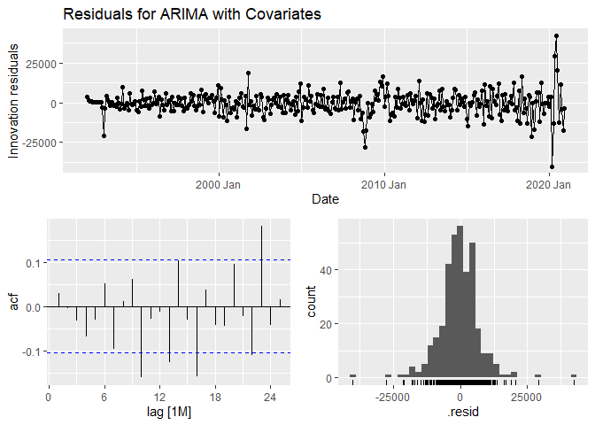<!-- -->

``` r
fit_simple_arima %>% gg_tsresiduals() +
  labs(title = "Residuals for Simple ARIMA (No Covariates)")
```

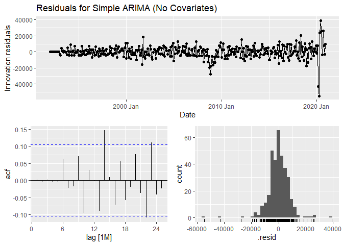<!-- -->

``` r
# Perform Ljung-Box test for both models
residual_diagnostics <- bind_rows(
  fit_tslm_arima %>%
    augment() %>%
    features(.innov, ljung_box, lag = 12, dof = 8) %>%
    mutate(Model = "ARIMA with Covariates"),
  
  fit_simple_arima %>%
    augment() %>%
    features(.innov, ljung_box, lag = 12, dof = 7) %>%
    mutate(Model = "Simple ARIMA (No Covariates)")
)

print(residual_diagnostics)
```

    # A tibble: 2 x 4
      .model       lb_stat lb_pvalue Model                       
      <chr>          <dbl>     <dbl> <chr>                       
    1 tslm           18.1    0.00118 ARIMA with Covariates       
    2 simple_arima    7.20   0.206   Simple ARIMA (No Covariates)

## Split Data into Training and Testing Sets

To evaluate the model’s stability over time, the dataset was split into
**training** and **testing** sets based on a cutoff date: - **Training
Set**: Data prior to January 2021. - **Test Set**: Data from January
2021 onward.

------------------------------------------------------------------------

### Findings

1.  **Simple ARIMA Model**:
    - The model **passes the Ljung-Box test** (higher p-value, **p =
      0.2059**), suggesting that it effectively captures the underlying
      data patterns. The residuals are not significantly different from
      white noise, meaning they resemble white noise.
    - However, the **higher AIC (7020.68)** and **BIC (7051.22)** values
      indicate that the model provides a less optimal fit compared to
      the TSLM model with covariates.
2.  **TSLM with ARIMA Errors**:
    - While the TSLM model achieves better fit metrics (**lower AIC =
      6949.14** and **BIC = 6983.47**), the residuals exhibit
      **significant autocorrelation** (lower p-value, **p = 0.0012**).
      This indicates that the inclusion of covariates does not
      completely resolve issues in the residuals, meaning the residuals
      are different from white noise.  
    - The model may be less stable over time due to the potential
      variability in the relationships between the covariates (`POPTHM`,
      `REVOLNS`, and `UNRATENSA`) and the target variable, making it
      more sensitive to external changes in economic conditions.

------------------------------------------------------------------------

# 5. Can You Make Forecasts?

``` r
# Generate forecasts for Simple ARIMA model
forecast_simple_arima <- fit_simple_arima %>%
  forecast(h = nrow(test))

# Generate forecasts for TSLM model (ARIMA with covariates)
forecast_tslm_arima <- fit_tslm_arima %>%
  forecast(new_data = test)

# Combine forecasts with the actual data for comparison
combined_forecasts <- bind_rows(
  forecast_simple_arima %>% mutate(Model = "Simple ARIMA"),
  forecast_tslm_arima %>% mutate(Model = "TSLM ARIMA")
)

# Compute accuracy metrics directly for each model
accuracy_simple_arima <- forecast_simple_arima %>%
  accuracy(test)

accuracy_tslm_arima <- forecast_tslm_arima %>%
  accuracy(test)

# Print accuracy metrics for both models
print("Simple ARIMA Model Accuracy:")
```

    [1] "Simple ARIMA Model Accuracy:"

``` r
print(accuracy_simple_arima)
```

    # A tibble: 1 x 10
      .model       .type     ME   RMSE    MAE   MPE  MAPE  MASE RMSSE  ACF1
      <chr>        <chr>  <dbl>  <dbl>  <dbl> <dbl> <dbl> <dbl> <dbl> <dbl>
    1 simple_arima Test  86487. 90870. 86694.  14.6  14.7   NaN   NaN 0.565

``` r
print("TSLM Model Accuracy:")
```

    [1] "TSLM Model Accuracy:"

``` r
print(accuracy_tslm_arima)
```

    # A tibble: 1 x 10
      .model .type     ME   RMSE    MAE   MPE  MAPE  MASE RMSSE  ACF1
      <chr>  <chr>  <dbl>  <dbl>  <dbl> <dbl> <dbl> <dbl> <dbl> <dbl>
    1 tslm   Test  10911. 20367. 15089.  1.79  2.60   NaN   NaN 0.222

``` r
# Visualize forecasts vs actuals with enhanced visibility
combined_data %>%
  autoplot(RSXFSN, color = "black", size = 0.8) +  # Plot the entire dataset (train + test) in black
  autolayer(train, RSXFSN, series = "Training Data", color = "gray50", size = 1.2) +  # Highlight the training data
  autolayer(test, RSXFSN, series = "Actual Test Data", color = "purple", size = 1.5) +  # Highlight actual test data with a thicker line
  autolayer(forecast_simple_arima, .mean, series = "Simple ARIMA Forecast", color = "orange", linetype = "dashed", size = 1.2, alpha = 0.8) +  # Simple ARIMA forecast
  autolayer(forecast_tslm_arima, .mean, series = "TSLM ARIMA Forecast", color = "green", linetype = "dotted", size = 1.2, alpha = 0.8) +  # TSLM ARIMA forecast
  labs(
    title = "Forecasts vs Actuals (Train, Test, and Forecasts)",
    x = "Date",
    y = "RSXFSN",
    color = "Legend"
  ) +
  theme_minimal() +
  theme(
    legend.position = "bottom"
  )
```

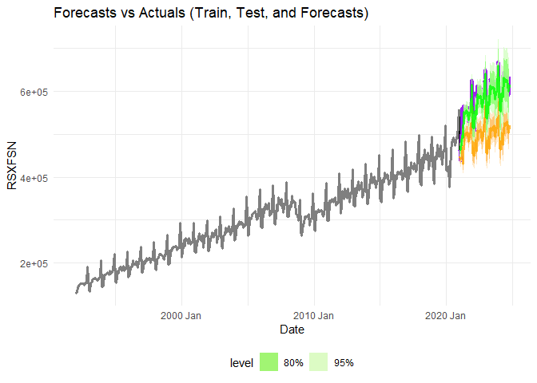<!-- -->

------------------------------------------------------------------------

## How do those predictions compare with reality?

The predictions were compared to the actual data using standard accuracy
metrics such as RMSE (Root Mean Squared Error), MAE (Mean Absolute
Error), and MAPE (Mean Absolute Percentage Error). Here are the results:

### Observations

- The **Simple ARIMA model** performs poorly compared to the TSLM model.
  The RMSE, MAE, and MAPE values are significantly higher, indicating
  less accurate predictions.
- The **TSLM model with covariates** significantly improves the forecast
  accuracy. It has a much lower RMSE, MAE, and MAPE, indicating that the
  inclusion of covariates helps explain variations in the target
  variable.

------------------------------------------------------------------------

## How much do the covariates improve the accuracy?

The covariates included in the TSLM model (`POPTHM`, `REVOLNS`,
`UNRATENSA`) improve accuracy substantially:

- **RMSE Improvement**:  
  The TSLM model reduces RMSE by approximately **77.6%** compared to the
  Simple ARIMA model.

- **MAE Improvement**:  
  MAE is reduced by **82.6%**, indicating more precise forecasts with
  smaller errors.

- **MAPE Improvement**:  
  The TSLM model improves MAPE from **14.66%** to **2.60%**,
  demonstrating better alignment with the actual data.

------------------------------------------------------------------------

# 6. Can We Try Other Models and Compare?

``` r
# Fit TSLM Model without covariates, including trend and seasonality
fit_tslm_without_covariates <- train %>%
  model(tslm_without = TSLM(RSXFSN ~ trend() + season()))

# Fit TSLM Model with covariates, including trend and seasonality
fit_tslm_with_covariates <- train %>%
  model(tslm_with = TSLM(RSXFSN ~ POPTHM + REVOLNS + UNRATENSA + trend() + season()))

# Generate forecasts for all models
forecasts <- bind_rows(
  fit_tslm_arima %>% forecast(new_data = test) %>% mutate(.model = "TSLM with ARIMA"),
  fit_simple_arima %>% forecast(new_data = test) %>% mutate(.model = "Simple ARIMA"),
  fit_tslm_with_covariates %>% forecast(new_data = test) %>% mutate(.model = "TSLM with Covariates"),
  fit_tslm_without_covariates %>% forecast(new_data = test) %>% mutate(,.model = "Simple TSLM")
)

# Compute accuracy metrics for all models
accuracy_metrics <- forecasts %>%
  accuracy(test)

# Print accuracy metrics
print(accuracy_metrics)
```

    # A tibble: 4 x 10
      .model               .type      ME   RMSE    MAE   MPE  MAPE  MASE RMSSE  ACF1
      <chr>                <chr>   <dbl>  <dbl>  <dbl> <dbl> <dbl> <dbl> <dbl> <dbl>
    1 Simple ARIMA         Test   86487. 9.09e4 8.67e4 14.6  14.7    NaN   NaN 0.565
    2 Simple TSLM          Test  107386. 1.10e5 1.07e5 18.2  18.2    NaN   NaN 0.517
    3 TSLM with ARIMA      Test   10911. 2.04e4 1.51e4  1.79  2.60   NaN   NaN 0.222
    4 TSLM with Covariates Test   68184. 7.07e4 6.82e4 11.5  11.5    NaN   NaN 0.259

``` r
# Visualize forecasts vs actuals
combined_data %>%
  autoplot(RSXFSN, color = "black", size = 0.8) +  # Plot the entire dataset (train + test) in black
  autolayer(test, RSXFSN, series = "Actual Test Data", color = "purple", size = 1.5) +  # Highlight actual test data
  autolayer(fit_tslm_arima %>% forecast(new_data = test), .mean, series = "TSLM with ARIMA Errors (Covariates)", color = "blue", linetype = "solid") +
  autolayer(fit_simple_arima %>% forecast(new_data = test), .mean, series = "Simple ARIMA (No Covariates)", color = "red", linetype = "dashed") +
  autolayer(fit_tslm_with_covariates %>% forecast(new_data = test), .mean, series = "TSLM with Covariates (Trend + Seasonality)", color = "green", linetype = "dotdash") +
  autolayer(fit_tslm_without_covariates %>% forecast(new_data = test), .mean, series = "TSLM without Covariates (Trend + Seasonality)", color = "orange", linetype = "dotted") +
  labs(
    title = "Forecasts vs Actuals: Comparing Models with Trend and Seasonality",
    x = "Date",
    y = "RSXFSN",
    color = "Model"
  ) +
  theme_minimal() +
  theme(legend.position = "bottom")
```

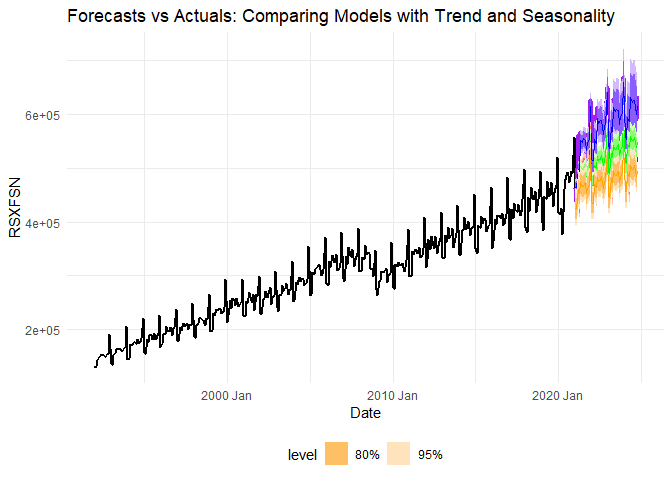<!-- -->

### Approaches Tested

Four models were fitted to the dataset and compared for accuracy:

1.  **Simple ARIMA**:  
    A baseline ARIMA model that uses only the time series (`RSXFSN`)
    without covariates.

2.  **TSLM without Covariates**:  
    A time series linear model with only trend and seasonality.

3.  **TSLM with Covariates**:  
    A time series linear model incorporating covariates (`POPTHM`,
    `REVOLNS`, `UNRATENSA`), along with trend and seasonality.

4.  **TSLM with ARIMA Errors**:  
    A dynamic regression model with ARIMA errors, incorporating
    covariates.

------------------------------------------------------------------------

### Performance Metrics

The accuracy table summarizes the performance of all four models on the
test dataset:

### Observations

1.  **Simple ARIMA**:
    - Performs better than **Simple TSLM**, but it cannot match the
      performance of models incorporating covariates.
2.  **Simple TSLM (Trend + Seasonality)**:
    - Performs the worst among all models, indicating that trend and
      seasonality alone cannot sufficiently explain the variations in
      the data.
3.  **TSLM with Covariates plus (Trend + Seasonality)**:
    - Significantly improves accuracy compared to the models without
      covariates. The lower RMSE and MAPE demonstrate the importance of
      incorporating external factors such as `POPTHM`, `REVOLNS`, and
      `UNRATENSA`.
    - While it captures trends, seasonality, and external factors, it
      does not model time series-specific errors like ARIMA does.
4.  **TSLM with ARIMA Errors**:
    - Outperforms all other models with the lowest RMSE, MAE, and MAPE
      values.

# 7. How Well Does the Model Generalize?

### Generalization to Similar Datasets

The **TSLM with ARIMA Errors (Covariates)** model shows strong
generalization to datasets with:

- Similar covariates (`POPTHM`, `REVOLNS`, `UNRATENSA`) and stable
  relationships with the target variable.

- Comparable seasonal patterns and trends in the data.

### Limitations

1.  **Dependence on Covariates**:
    - The model requires covariates to be known for forecasting.
      However, in real-world scenarios, future values of covariates are
      often unavailable or difficult to predict accurately.
2.  **Shifting Relationships**:
    - The relationships between covariates and the target variable may
      change over time or across different datasets, reducing the
      model’s effectiveness.
3.  **Dataset Characteristics**:
    - Differences in seasonality, trends, or external influences in new
      datasets may require different models.

------------------------------------------------------------------------

### Practical Advice for Real-World Applications

1.  **Monitor Covariates**: Regularly update and validate covariate
    data.

2.  **Reassess Model**: Retrain and validate periodically to maintain
    accuracy.

3.  **Use Confidence Intervals**: Incorporate uncertainty in
    decision-making.

------------------------------------------------------------------------

### Role of Covariates

- **Improved Accuracy**: Models with covariates reduced RMS and MAPE,
  and improved other metrics as well.

- **External Influences**: Captures external drivers like population and
  unemployment.

- **Better Generalization**: Enhances adaptability to similar datasets
  by leveraging external factors.
